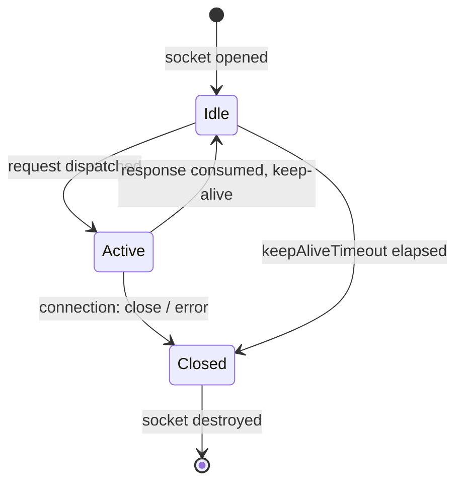

Every HTTP request requires a TCP connection. Opening a new connection involves a TCP handshake and, for HTTPS, a TLS handshake — adding tens to hundreds of milliseconds of latency before the first byte of data is transferred. Connection pooling solves this by keeping connections alive and reusing them for subsequent requests, eliminating the handshake overhead entirely.

undici provides several dispatcher types with different pooling characteristics. Choosing the right one depends on how many origins you need to reach and how much control you need over the connection count.

## Why connection pooling matters

Without pooling, each request would:

1. Resolve DNS for the hostname
2. Open a TCP connection (SYN / SYN-ACK / ACK)
3. Complete a TLS handshake (for HTTPS)
4. Send the request
5. Receive the response
6. Close the connection

With keep-alive connections, steps 1–3 happen only once per connection. undici enables keep-alive by default on all connections.

## Choosing the right dispatcher

<Columns cols={2}>
  <Card title="Client" icon="plug">
    **Single connection, single origin.** Use when you need exactly one TCP/TLS connection to a known upstream. Pipelining is disabled by default.
  </Card>
  <Card title="Pool" icon="layer-group">
    **Multiple connections, single origin.** Distributes requests across a configurable number of `Client` instances. The `connections` option controls the pool size (`null` = unlimited).
  </Card>
  <Card title="BalancedPool" icon="scale-balanced">
    **Multiple connections, multiple origins.** Weighted round-robin across a set of upstreams. Useful for distributing load across known backend servers.
  </Card>
  <Card title="Agent" icon="robot">
    **Automatic pooling, any number of origins.** Creates and manages one `Pool` per origin automatically. This is the default global dispatcher and the right choice for general-purpose use.
  </Card>
</Columns>

### When to use each

| Scenario | Recommended dispatcher |
|---|---|
| Talking to one known backend, need precise control | `Client` |
| High-throughput requests to one origin | `Pool` with tuned `connections` |
| Load-balancing across a fixed set of backends | `BalancedPool` |
| General-purpose HTTP client for multiple origins | `Agent` (default) |
| Proxying through HTTP/HTTPS proxy | `ProxyAgent` |

## Client: single connection

`Client` opens one TCP/TLS connection to a single origin. All requests share that one socket. This is the foundation on which `Pool` and `Agent` are built.

```javascript creating a Client
import { Client } from 'undici'

const client = new Client('https://api.example.com', {
  // Send one request at a time (default)
  pipelining: 1,
  // Keep idle socket alive for 30 seconds
  keepAliveTimeout: 30e3,
  // Body must arrive within 60 seconds
  bodyTimeout: 60e3
})

const { statusCode, body } = await client.request({
  path: '/users',
  method: 'GET'
})

console.log(statusCode)
await body.dump() // must always consume the body

await client.close()
```

`Client` connects lazily — the socket is only opened when the first request is queued.

## Pool: multiple connections to one origin

`Pool` manages a set of `Client` instances connected to the same upstream. When a request arrives, it picks an available client from the pool. If all clients are busy and the pool has not reached its connection limit, it creates a new `Client`.

```javascript creating a Pool with connection limit
import { Pool } from 'undici'

const pool = new Pool('https://api.example.com', {
  // Maximum 10 concurrent TCP connections
  connections: 10,
  // Each connection handles one request at a time
  pipelining: 1,
  keepAliveTimeout: 30e3,
  bodyTimeout: 60e3,
  headersTimeout: 10e3
})

// All requests share the pool of up to 10 connections
const responses = await Promise.all([
  pool.request({ path: '/a', method: 'GET' }),
  pool.request({ path: '/b', method: 'GET' }),
  pool.request({ path: '/c', method: 'GET' })
])

for (const { body } of responses) {
  await body.dump()
}

await pool.close()
```

When `connections` is `null` (the default), the pool grows unbounded. Set an explicit limit to avoid exhausting file descriptors or server connection limits.

### Pool stats

```javascript inspecting pool stats
import { Pool } from 'undici'

const pool = new Pool('https://api.example.com', { connections: 5 })

// PoolStats: { connected, free, pending, queued, running, size }
console.log(pool.stats)
```

## BalancedPool: multiple origins

`BalancedPool` uses a weighted round-robin algorithm to distribute requests across multiple upstream `Pool` instances. Each upstream gets a weight, and the algorithm adjusts weights based on errors.

```javascript BalancedPool across multiple backends
import { BalancedPool } from 'undici'

const pool = new BalancedPool([
  'https://backend-1.example.com',
  'https://backend-2.example.com',
  'https://backend-3.example.com'
], {
  connections: 5,
  keepAliveTimeout: 30e3
})

const { statusCode, body } = await pool.request({
  path: '/api/data',
  method: 'GET'
})

await body.dump()
await pool.close()
```

## Agent: automatic pooling for multiple origins

`Agent` is the most flexible dispatcher. It creates a `Pool` per origin on demand and cleans them up when they become idle. This is the default global dispatcher.

The internal factory function chooses between `Client` and `Pool` based on the `connections` option:

```javascript agent factory logic (from lib/dispatcher/agent.js)
function defaultFactory (origin, opts) {
  return opts && opts.connections === 1
    ? new Client(origin, opts)
    : new Pool(origin, opts)
}
```

```javascript creating a custom Agent
import { Agent, setGlobalDispatcher } from 'undici'

const agent = new Agent({
  // Applied to every Pool the Agent creates
  connections: 10,
  pipelining: 1,
  keepAliveTimeout: 30e3,
  keepAliveMaxTimeout: 600e3,
  bodyTimeout: 60e3,
  headersTimeout: 10e3,
  // Limit origins to prevent unbounded growth
  maxOrigins: 100
})

// Use as the global dispatcher (affects fetch, request, etc.)
setGlobalDispatcher(agent)

// Or use directly
const { statusCode, body } = await agent.request({
  origin: 'https://api.example.com',
  path: '/data',
  method: 'GET'
})
await body.dump()
```

## Key options

### Timeout options

<ParamField path="keepAliveTimeout" type="number" default="4000">
  Milliseconds an idle socket remains open before closing. Overridden by server `keep-alive` hints. Default: 4 seconds.
</ParamField>

<ParamField path="keepAliveMaxTimeout" type="number" default="600000">
  Maximum `keepAliveTimeout` in milliseconds when the server overrides it via `keep-alive` hints. Default: 10 minutes.
</ParamField>

<ParamField path="keepAliveTimeoutThreshold" type="number" default="2000">
  Milliseconds subtracted from server keep-alive hints to account for transport latency. Default: 2 seconds.
</ParamField>

<ParamField path="headersTimeout" type="number" default="300000">
  Milliseconds to wait for complete HTTP headers after sending a request. Default: 300 seconds.
</ParamField>

<ParamField path="bodyTimeout" type="number" default="300000">
  Milliseconds between body data chunks before timing out. Set to `0` to disable. Default: 300 seconds.
</ParamField>

<ParamField path="connectTimeout" type="number" default="10000">
  Milliseconds to wait when establishing a new TCP/TLS connection. Configured via the `connect` options object.
</ParamField>

### Pool size options

<ParamField path="connections" type="number | null" default="null">
  Maximum number of `Client` instances in a `Pool`. `null` means unlimited. On `Agent`, applies to each per-origin pool.
</ParamField>

<ParamField path="pipelining" type="number" default="1">
  Number of concurrent requests per connection. Set to `0` to disable keep-alive. Values greater than `1` enable HTTP pipelining.
</ParamField>

<ParamField path="clientTtl" type="number | null" default="null">
  Milliseconds before a `Client` instance is removed from the pool and closed. Useful for forcing connection rotation.
</ParamField>

### Tuning for high-throughput workloads

```javascript tuning a Pool for high throughput
import { Pool } from 'undici'

const pool = new Pool('https://api.example.com', {
  // Up to 20 concurrent connections
  connections: 20,
  // Keep idle connections alive for 2 minutes
  keepAliveTimeout: 120e3,
  // Maximum keep-alive from server hints: 10 minutes
  keepAliveMaxTimeout: 600e3,
  // Fast timeout for headers (fail quickly on slow responses)
  headersTimeout: 5e3,
  // Longer timeout for streaming body data
  bodyTimeout: 120e3
})
```

## TLS session reuse with `maxCachedSessions`

For HTTPS connections, TLS handshakes add significant overhead. undici caches TLS sessions so subsequent connections can skip the full handshake (TLS session resumption).

The `maxCachedSessions` option is passed through the `connect` configuration object:

<ParamField path="connect.maxCachedSessions" type="number" default="100">
  Maximum number of TLS sessions cached per origin. Set to `0` to disable TLS session caching entirely.
</ParamField>

```javascript configuring TLS session caching
import { Pool } from 'undici'

const pool = new Pool('https://api.example.com', {
  connections: 10,
  connect: {
    // Cache up to 200 TLS sessions
    maxCachedSessions: 200,
    // TCP keep-alive prevents NAT/firewall from dropping idle connections
    keepAlive: true,
    keepAliveInitialDelay: 60000
  }
})
```

<Tip>
  TLS session resumption can reduce handshake time from ~100ms to ~10ms. Increase `maxCachedSessions` if your pool has many connections cycling through.
</Tip>

## Connection lifecycle

A connection in undici moves through these states:



- **Idle**: connected but no active request. The socket is kept alive up to `keepAliveTimeout` milliseconds.
- **Active**: a request is in progress. The socket is sending or receiving data.
- **Closed**: the socket has been destroyed. The pool may open a new connection for subsequent requests.

## The body consumption requirement

<Warning>
  All response bodies must be fully consumed or destroyed. If you do not consume the body, the connection cannot be returned to the pool and will eventually time out, degrading performance.
</Warning>

```javascript consuming the body in every code path
import { Pool } from 'undici'

const pool = new Pool('https://api.example.com', { connections: 5 })

const { statusCode, body } = await pool.request({
  path: '/data',
  method: 'GET'
})

if (statusCode === 200) {
  // Consume by reading
  const data = await body.json()
  return data
}

// Always consume even when not reading
await body.dump()
return null
```

Three ways to consume a body:

| Method | When to use |
|---|---|
| `body.json()` / `body.text()` / `body.arrayBuffer()` | You need the response content |
| `body.dump()` | You do not need the content but want to keep the connection |
| `body.destroy()` | You want to close the connection immediately |
