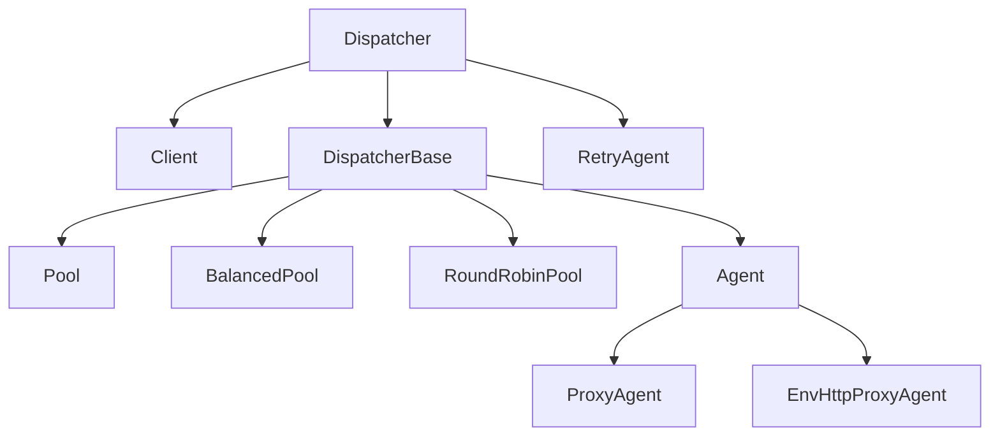

Dispatchers are the central abstraction in undici. Every HTTP request flows through a dispatcher, which is responsible for managing connections, sending requests, and delivering responses. Whether you use the high-level `request()` function or configure a custom `Agent`, you are always working with a dispatcher under the hood.

## What is a dispatcher?

`Dispatcher` is an abstract base class that extends Node.js `EventEmitter`. It defines the contract that all HTTP dispatch implementations must follow. You never instantiate `Dispatcher` directly — instead you use one of its concrete subclasses.

The class is defined in `lib/dispatcher/dispatcher.js` and exposes three abstract methods that subclasses must implement:

```javascript dispatcher.js (simplified)
class Dispatcher extends EventEmitter {
  dispatch () {
    throw new Error('not implemented')
  }

  close () {
    throw new Error('not implemented')
  }

  destroy () {
    throw new Error('not implemented')
  }
}
```

Higher-level methods (`request`, `stream`, `pipeline`, `connect`, `upgrade`) are mixed in from `lib/api` via `Object.assign(Dispatcher.prototype, api)` in `index.js`.

## The dispatcher hierarchy

undici ships several built-in dispatcher implementations. Each one is appropriate for different use cases.



<Columns cols={2}>
  <Card title="Client" icon="plug">
    A single HTTP/1.1 connection to one origin. Pipelining is disabled by default (`pipelining: 1`). Use when you need precise control over one connection.
  </Card>
  <Card title="Pool" icon="layer-group">
    Multiple `Client` instances connected to the same origin. Distributes requests across connections. The `connections` option controls the pool size.
  </Card>
  <Card title="BalancedPool" icon="scale-balanced">
    Weighted round-robin load balancing across multiple upstream origins. Useful for distributing load across a set of backend servers.
  </Card>
  <Card title="Agent" icon="robot">
    Automatically manages a pool per origin. This is the default global dispatcher. The factory function creates a `Pool` (or `Client` when `connections: 1`).
  </Card>
  <Card title="ProxyAgent" icon="shield">
    Routes requests through an HTTP or HTTPS proxy. Extends `Agent` with proxy-aware connection logic.
  </Card>
  <Card title="RetryAgent" icon="rotate">
    Wraps another dispatcher and adds automatic retry logic at the agent level.
  </Card>
</Columns>

## Key methods

Every dispatcher exposes the same set of methods inherited from `Dispatcher`.

### `dispatch(options, handler)`

The lowest-level API. All other methods are implemented on top of `dispatch`. It accepts a `DispatchOptions` object and a `DispatchHandler` object, and returns `false` if the dispatcher is busy (back-pressure signal).

```javascript dispatch a GET request
import { Client } from 'undici'

const client = new Client('http://localhost:3000')

const data = []

client.dispatch({
  path: '/',
  method: 'GET',
  headers: { 'x-foo': 'bar' }
}, {
  onRequestStart: () => {
    console.log('Connected!')
  },
  onResponseStart: (_controller, statusCode, headers) => {
    console.log(`Status: ${statusCode}`)
  },
  onResponseData: (_controller, chunk) => {
    data.push(chunk)
  },
  onResponseEnd: (_controller, trailers) => {
    console.log(Buffer.concat(data).toString('utf8'))
    client.close()
  },
  onResponseError: (_controller, error) => {
    console.error(error)
  }
})
```

### `request(options[, callback])`

Performs an HTTP request and resolves with `{ statusCode, headers, body, trailers }`. The `body` is a `stream.Readable` that also implements the Fetch body mixin (`json()`, `text()`, `arrayBuffer()`, etc.).

<Warning>
  All response bodies must always be fully consumed or destroyed. Failing to consume the body will prevent the connection from being reused. If you do not need the body, call `body.dump()` or `body.destroy()`.
</Warning>

```javascript request with body consumption
import { Client } from 'undici'

const client = new Client('http://localhost:3000')

const { statusCode, body } = await client.request({
  path: '/data',
  method: 'GET'
})

if (statusCode === 200) {
  const json = await body.json()
  console.log(json)
} else {
  // Always consume the body, even when you don't need it
  await body.dump()
}
```

### `stream(options, factory[, callback])`

A faster variant of `request` that writes the response body directly into a `stream.Writable` returned by the `factory` function. This avoids creating an intermediate `Readable` stream.

### `pipeline(options, handler)`

Designed for use with `stream.pipeline`. The handler receives `{ statusCode, headers, body }` and must return a `stream.Readable`. Returns a `stream.Duplex`.

### `connect(options[, callback])`

Initiates an HTTP CONNECT tunnel. Returns a raw `stream.Duplex` socket for two-way communication.

### `upgrade(options[, callback])`

Upgrades an HTTP connection to a different protocol (e.g., WebSocket). Returns the upgraded socket.

## The handler object

When calling `dispatch()` directly you must provide a handler. The handler is a plain object with lifecycle callbacks:

<AccordionGroup>
  <Accordion title="onRequestStart(controller, context)">
    Called before the request is dispatched on the socket. May be called multiple times if the request is retried. Use `controller.abort(reason)` to cancel.
  </Accordion>
  <Accordion title="onResponseStart(controller, statusCode, headers, statusMessage)">
    Called when the status code and headers have been received. May be called multiple times for 1xx informational responses.
  </Accordion>
  <Accordion title="onResponseData(controller, chunk)">
    Called for each chunk of response body data received.
  </Accordion>
  <Accordion title="onResponseEnd(controller, trailers)">
    Called when the response body and any trailers have been fully received.
  </Accordion>
  <Accordion title="onResponseError(controller, error)">
    Called when an error occurs. Must not throw.
  </Accordion>
  <Accordion title="onRequestUpgrade(controller, statusCode, headers, socket)">
    Required when `options.upgrade` is set or method is `CONNECT`. Called when the protocol upgrade is complete.
  </Accordion>
</AccordionGroup>

The `controller` object passed to each callback provides `pause()`, `resume()`, and `abort(reason)` methods to control backpressure and cancellation. Raw headers are accessible via `controller.rawHeaders`.

## The global dispatcher

undici maintains a global dispatcher used by the top-level `request`, `fetch`, and other convenience functions. By default it is a new `Agent` instance, initialized in `lib/global.js`:

```javascript lib/global.js (simplified)
const globalDispatcher = Symbol.for('undici.globalDispatcher.2')

if (getGlobalDispatcher() === undefined) {
  setGlobalDispatcher(new Agent())
}

function setGlobalDispatcher (agent) {
  if (!agent || typeof agent.dispatch !== 'function') {
    throw new InvalidArgumentError('Argument agent must implement Agent')
  }
  Object.defineProperty(globalThis, globalDispatcher, {
    value: agent,
    writable: true
  })
}

function getGlobalDispatcher () {
  return globalThis[globalDispatcher]
}
```

You can replace the global dispatcher with any `Dispatcher` implementation:

```javascript setting a custom global dispatcher
import { Agent, setGlobalDispatcher, getGlobalDispatcher } from 'undici'

// Replace the global dispatcher with a tuned Agent
setGlobalDispatcher(new Agent({
  connections: 10,
  pipelining: 1,
  keepAliveTimeout: 30e3
}))

// All top-level undici functions now use this dispatcher
const { statusCode, body } = await request('https://example.com/')
await body.dump()

// Retrieve the current global dispatcher
const dispatcher = getGlobalDispatcher()
```

<Note>
  `setGlobalDispatcher` also mirrors the agent to `Symbol.for('undici.globalDispatcher.1')` using a `Dispatcher1Wrapper` so Node.js built-in `fetch` can continue using the legacy handler interface.
</Note>

## Composing dispatchers with `.compose()`

Every dispatcher exposes a `.compose()` method that wraps it with one or more interceptor functions, returning a new dispatcher. Interceptors follow the pattern `dispatch => (opts, handler) => dispatch(opts, handler)`.

```javascript compose() implementation (simplified)
compose (...args) {
  const interceptors = Array.isArray(args[0]) ? args[0] : args
  let dispatch = this.dispatch.bind(this)

  for (const interceptor of interceptors) {
    dispatch = interceptor(dispatch)
  }

  return new Proxy(this, {
    get: (target, key) => key === 'dispatch' ? dispatch : target[key]
  })
}
```

The order of interceptors matters. When you compose `[interceptor1, interceptor2, interceptor3]`, the request flows through them in **reverse order**: interceptor3 runs first, interceptor1 last.

```javascript chaining interceptors with compose
import { Client, interceptors } from 'undici'

const { redirect, retry } = interceptors

const client = new Client('http://api.example.com')
  .compose(redirect({ maxRedirections: 3 }))
  .compose(retry({ maxRetries: 2, minTimeout: 500 }))

// Retry interceptor wraps redirect interceptor.
// On each retry, redirect logic also applies.
await client.request({ path: '/data', method: 'GET' })
```

You can also pass an array:

```javascript compose with array of interceptors
import { Agent, interceptors } from 'undici'

const { cache, dns } = interceptors

const agent = new Agent().compose([
  dns({ maxTTL: 30e3 }),
  cache()
])
```

## HTTP pipelining

HTTP/1.1 pipelining allows sending multiple requests on a single connection without waiting for each response. undici implements pipelining via the `pipelining` option on `Client` or `Pool`.

<Tabs>
  <Tab title="Default (no pipelining)">
    ```javascript default pipelining of 1
    import { Client } from 'undici'

    // Default: pipelining: 1 — one request at a time per connection
    const client = new Client('http://api.example.com', {
      pipelining: 1
    })
    ```
  </Tab>
  <Tab title="Pipelining enabled">
    ```javascript pipelining enabled
    import { Client } from 'undici'

    // Send up to 4 concurrent requests on one connection
    const client = new Client('http://api.example.com', {
      pipelining: 4
    })
    ```
  </Tab>
</Tabs>

<Warning>
  Pipelining requires careful evaluation of your workload. It is sensitive to head-of-line blocking: a slow request at the front of the pipeline will delay all following requests on that connection. Non-idempotent requests (`POST`, `PUT`, etc.) are not pipelined by default.
</Warning>

The `blocking` option on individual requests controls pipelining behavior per-request. When `blocking: true`, no further pipelining occurs on that connection until the response headers are received. For requests expected to take a long time, set `blocking: true` to avoid holding up other requests.

```javascript blocking option per request
const { body } = await client.request({
  path: '/slow-endpoint',
  method: 'GET',
  blocking: true  // Do not pipeline more requests until this one responds
})
await body.dump()
```

## Lifecycle events

All dispatchers emit the following events:

| Event | Parameters | Description |
|---|---|---|
| `connect` | `origin, targets` | Emitted when a socket connects to the origin. |
| `disconnect` | `origin, targets, error` | Emitted when a socket disconnects. |
| `connectionError` | `origin, targets, error` | Emitted when a connection attempt fails. |
| `drain` | `origin` | Emitted when the dispatcher is no longer busy. |

## Closing a dispatcher

<Steps>
  <Step title="Graceful close">
    Call `dispatcher.close()` to wait for all in-flight requests to complete before closing connections.

    ```javascript graceful close
    await client.close()
    ```
  </Step>
  <Step title="Immediate destroy">
    Call `dispatcher.destroy([error])` to abort all pending and running requests immediately.

    ```javascript immediate destroy
    await client.destroy(new Error('shutting down'))
    ```
  </Step>
</Steps>
